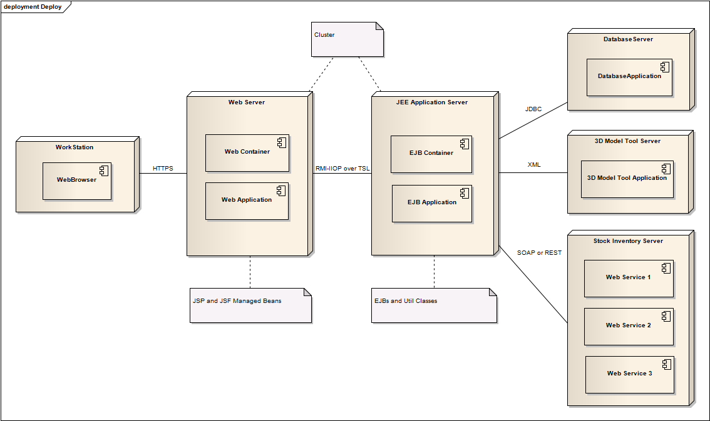
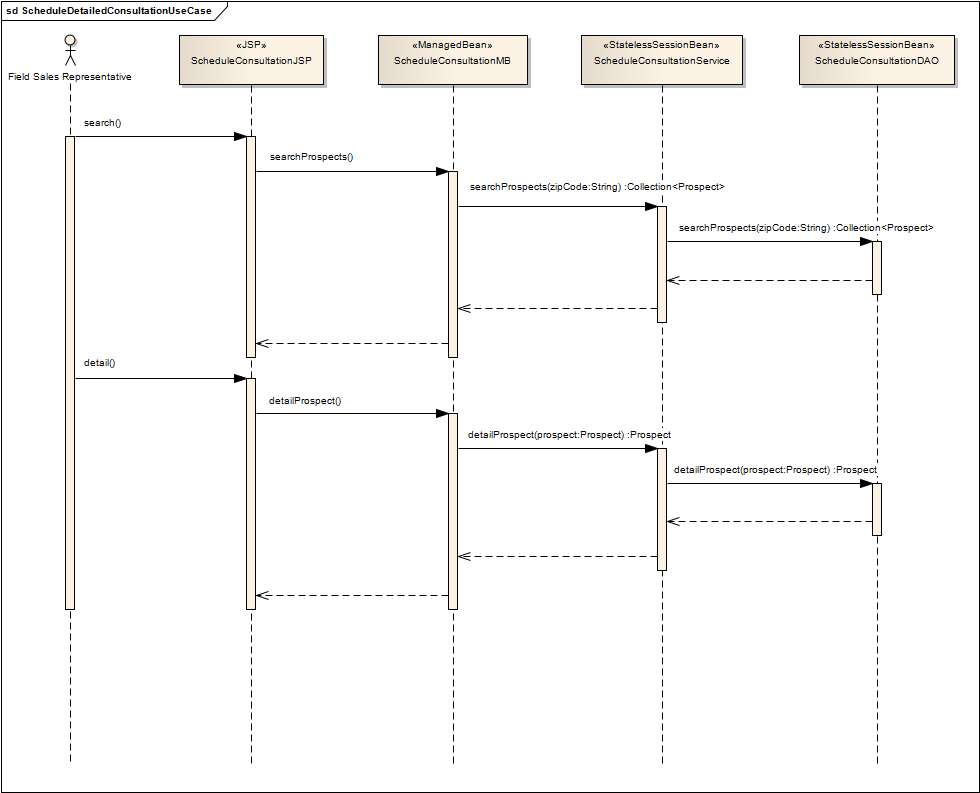

# oracle-cert-project-ocmjea

Project used to get Oracle Certified Master Java EE 5 Enterprise Architect (OCMJEA)

## Support

- Java Compile version: 1.8

## Diagrams

### Class Diagram

### Component Diagram

### Deployment Diagram

### Sequence Diagram - Use Case Specification: Search Component Catalog

### Sequence Diagram - Use Case Specification: Add Item to House Design

### Sequence Diagram - Use Case Specification: Complete House Design

### Sequence Diagram - Use Case Specification: Schedule Detailed Consultation

## Credits

[smiguel.net](https://www.smiguel.net)

## License

**oracle-cert-project-ocmjea** is licensed under an Apache-2.0 license
